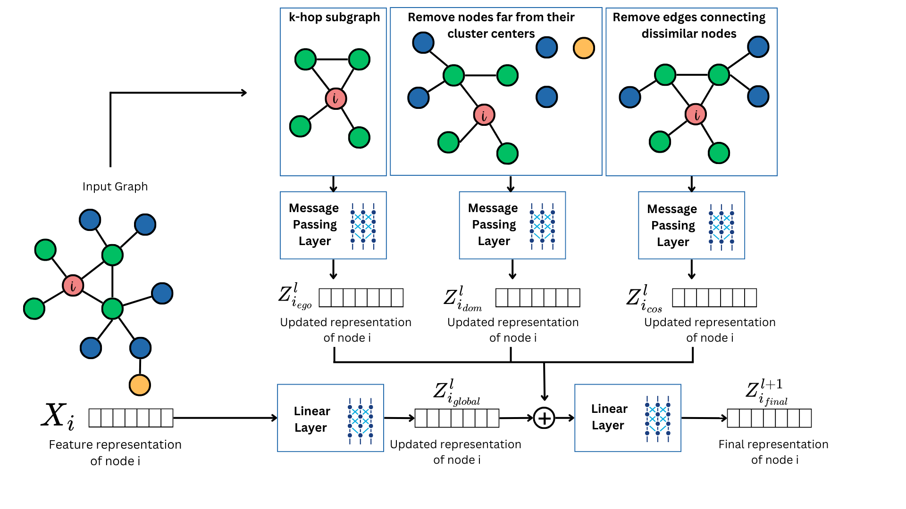

# Implementation of "Intrinsic Defenses Against Backdoor Attacks in High-Order Graph Neural Networks via Semantic and Outlier-Guided Subgraph Policies"

This repository contains the implementation and analysis of Backdoor attacks on Graph Neural Networks both Traditional (GCN, GraphSage and GAT) and Higher Order Graph Neural Network (ESAN, SUN, SAGNN and SAGNN+CS) and a new model SPROUT-GNN. 

<p align="center">
  
</p>

**Results on Cora dataset.** Each cell shows ASR/Accuracy. In the Baseline column the highest value is bolded; in each attack column, the lowest ASR is bolded and the highest clean accuracy is bolded.

| Model                | GNN Type     | SBA-Samp       | SBA-Gen        | GTA              | UGBA               | DPGBA              |
|----------------------|--------------|----------------|----------------|------------------|--------------------|--------------------|
| GCN                  | Traditional  | 96.67 / 87.00  | 96.67 / 86.44  | 70.00 / 86.14    | 96.67 / 85.95      | 96.67 / 85.89      |
| GraphSage            | Traditional  | 96.67 / 87.49  | 96.67 / 87.43  | 86.67 / 87.37    | 96.67 / 87.18      | 96.67 / 87.25      |
| GAT                  | Traditional  | 93.33 / 85.46  | 90.00 / 85.46  | 93.33 / 84.84    | 90.00 / 85.03      | 90.00 / 84.97      |
| SUN                  | Higher-Order | **0.00** / 86.32 | **0.00** / 86.14 | **10.00** / 86.88 | **10.00** / **87.31** | **0.00** / **87.31** |
| ESAN (ego)           | Higher-Order | **0.00** / 44.79 | **0.00** / 45.16 | 20.00 / 44.42    | **10.00** / 44.79   | **0.00** / 44.55   |
| ESAN (edge del)      | Higher-Order | 3.33 / 85.58    | **0.00** / 85.71 | 20.00 / 85.95    | **10.00** / 85.64   | **0.00** / 85.52   |
| ESAN (node del)      | Higher-Order | 3.33 / 85.83    | **0.00** / 85.34 | 20.00 / 85.64    | **10.00** / 85.89   | **0.00** / 85.95   |
| SAGN                 | Higher-Order | **0.00** / 85.89 | **0.00** / 85.83 | **10.00** / 85.58 | **10.00** / 86.14   | **0.00** / 85.58   |
| SAGN+CS              | Higher-Order | **0.00** / 87.19 | **0.00** / 87.49 | **10.00** / 86.69 | **10.00** / 87.37   | **0.00** / 86.82   |
| **Ours SPROUT-GNN**  | Higher-Order | **0.00** / **87.80** | **0.00** / 87.62 | 20.00 / **88.35** | **10.00** / 86.88   | **0.00** / 87.43   |


**Results on CiteSeer dataset.** Each cell shows ASR/Accuracy. In the Baseline column the highest value is bolded; in each attack column, the lowest ASR is bolded and the highest clean accuracy is bolded.


| Model                | GNN Type     | SBA-Samp         | SBA-Gen         | GTA              | UGBA               | DPGBA               |
|----------------------|--------------|------------------|-----------------|------------------|--------------------|---------------------|
| GCN                  | Traditional  | 95.56 / 72.88    | 96.67 / 72.43   | 90.00 / 72.98    | 96.67 / **73.33**  | 96.67 / 73.38       |
| GraphSage            | Traditional  | 93.33 / **76.84**| 93.33 / **76.69**| 92.22 / 76.04   | 94.44 / 75.74      | 93.33 / 75.74       |
| GAT                  | Traditional  | 95.56 / 72.63    | 95.56 / 72.83   | 93.33 / 72.78    | 94.44 / 72.63      | 94.44 / 72.73       |
| SUN                  | Higher-Order | **0.00** / 75.49 | 1.11 / 75.64    | 2.22 / 75.24     | 3.33 / **75.84**   | 2.22 / 76.04        |
| ESAN (ego)           | Higher-Order | 1.11 / 29.62     | **0.00** / 29.87| **0.00** / 29.82 | 3.33 / 29.47       | 3.33 / 29.83        |
| ESAN (edge del)      | Higher-Order | **0.00** / 72.73 | **0.00** / 72.68| **0.00** / 72.78 | 3.33 / 72.97       | **1.11** / 72.63    |
| ESAN (node del)      | Higher-Order | 2.22 / 73.08     | 1.11 / 72.70    | **0.00** / 72.53 | 3.33 / 72.78       | **1.11** / 72.63    |
| SAGN                 | Higher-Order | 2.22 / 75.89     | 1.11 / 76.44    | 3.33 / 75.94     | 3.33 / **76.49**   | 2.22 / **76.34**    |
| SAGN+CS              | Higher-Order | 1.11 / 76.09     | 1.11 / 76.24    | 3.33 / **76.19** | 3.33 / 76.04       | 3.33 / 75.94        |
| **Ours SPROUT-GNN**  | Higher-Order | **0.00** / 72.18 | **0.00** / 71.73| 6.67 / 72.33     | **0.00** / 71.43   | **3.33** / 72.78    |


**Results on PubMed dataset.** Each cell shows ASR/Accuracy. In the Baseline column the highest value is bolded; in each attack column, the lowest ASR is bolded and the highest clean accuracy is bolded.


| Model                | GNN Type     | SBA-Samp         | SBA-Gen         | GTA               | UGBA               | DPGBA               |
|----------------------|--------------|------------------|-----------------|-------------------|--------------------|---------------------|
| GCN                  | Traditional  | 95.00 / 86.35    | 95.00 / 86.89   | 37.50 / 86.36     | 95.00 / 87.15      | 94.17 / 87.33       |
| GraphSage            | Traditional  | 95.00 / 87.77    | 94.17 / **88.16**| 25.83 / 88.08    | 95.00 / 88.44      | 95.83 / **88.48**   |
| GAT                  | Traditional  | 96.67 / 87.20    | 95.83 / 86.95   | 87.50 / 86.14     | 95.00 / 86.83      | 95.83 / 86.93       |
| SUN                  | Higher-Order | 0.83 / 88.27     | **0.00** / **88.49**| 5.83 / 88.44  | 4.17 / **88.66**   | **0.00** / **88.70** |
| ESAN (ego)           | Higher-Order | 8.33 / 35.40     | 3.33 / 35.24    | 15.83 / 35.70     | 11.67 / 35.41      | 5.83 / 35.99        |
| ESAN (edge del)      | Higher-Order | 1.67 / 87.44     | **0.00** / 87.05| **2.50** / 87.51  | **2.50** / 87.07   | **0.00** / 87.58    |
| ESAN (node del)      | Higher-Order | 2.50 / 87.04     | 1.67 / 86.86    | **2.50** / 87.77  | **2.50** / 87.92   | **0.00** / 87.37    |
| SAGN                 | Higher-Order | 0.83 / 87.29     | **0.00** / 87.41| 3.33 / 87.44      | 5.00 / 87.34       | 0.83 / 87.51        |
| SAGN+CS              | Higher-Order | **0.00** / 87.45 | 0.83 / 87.44    | 4.17 / 87.58      | 3.33 / 87.49       | **0.00** / 87.32    |
| **Ours SPROUT-GNN**  | Higher-Order | **0.00** / 87.12 | **0.00** / 87.41| 3.33 / **87.58**  | 3.33 / **87.92**   | **0.00** / 87.49    |


# Project Setup and Installation

This project uses a `requirements.txt` file to list all the Python packages (and their specific versions) that the project depends on. Follow the steps below to set up your environment and install the required dependencies.

## Step 1: Open a Terminal or Command Prompt

Navigate to your project directory containing the `requirements.txt` file.

## Step 2: Create and Activate a Virtual Environment

It is a good practice to create a virtual environment so that the packages you install do not interfere with system-wide packages.

### Creating a Virtual Environment

Run the following command to create a virtual environment (using `venv`):

```bash
python -m venv venv
```

### Activating the Virtual Environment

- **On Windows:**

  ```bash
  venv\Scripts\activate
  ```

- **On macOS/Linux:**

  ```bash
  source venv/bin/activate
  ```

## Step 3: Install Dependencies Using pip

With your virtual environment activated (or in your global environment), run the following command:

```bash
pip install -r requirements.txt
```

This command tells pip to read the `requirements.txt` file and install all the listed packages.

## Step 4: Verify Installation

To verify that a package is installed correctly, you can run:

```bash
python -c "import torch; print(torch.__version__)"
```

This should print the installed version of PyTorch.

## Using an IDE

If you're using an IDE such as VS Code, you can use its integrated terminal to run these commands.

```
use python main.py to run all the models.
You can also specify the model which you want the results for by writing python main.py model_type (example: sagnn+cs or sagn or sun or esan or gnn).

```
[](https://doi.org/10.5281/zenodo.17095064)
